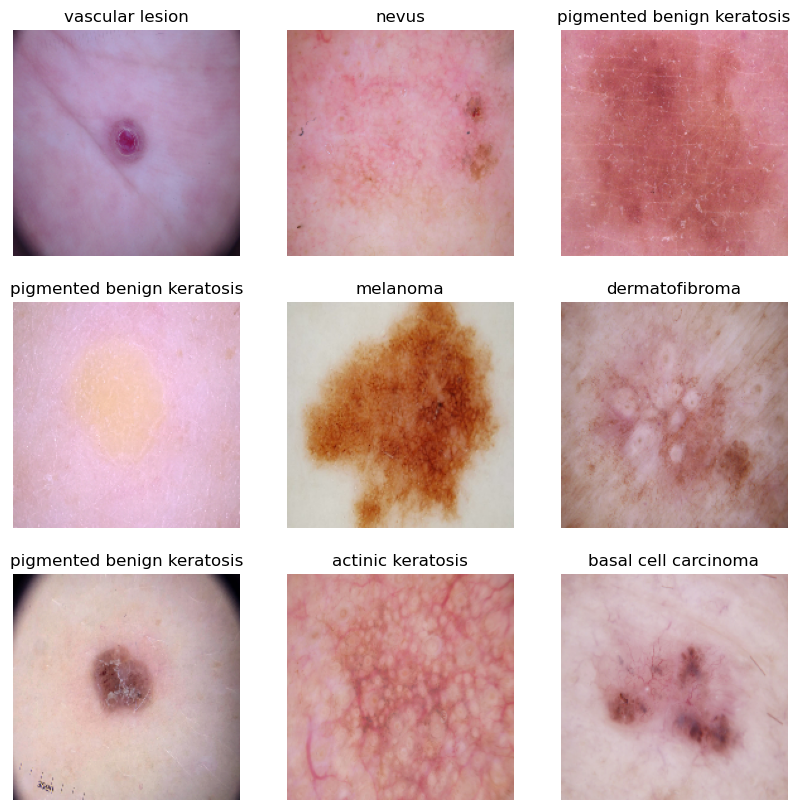
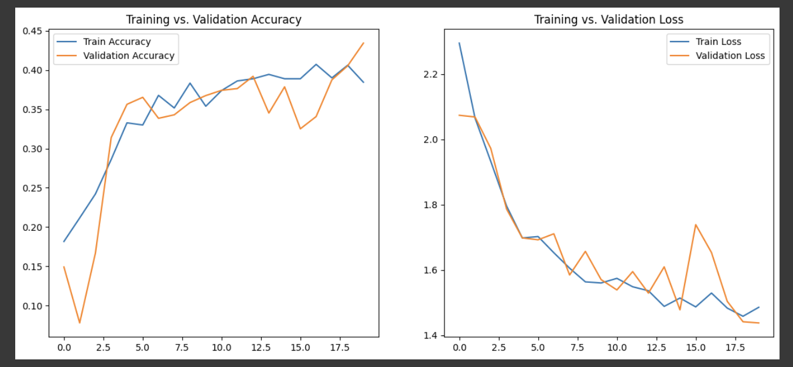
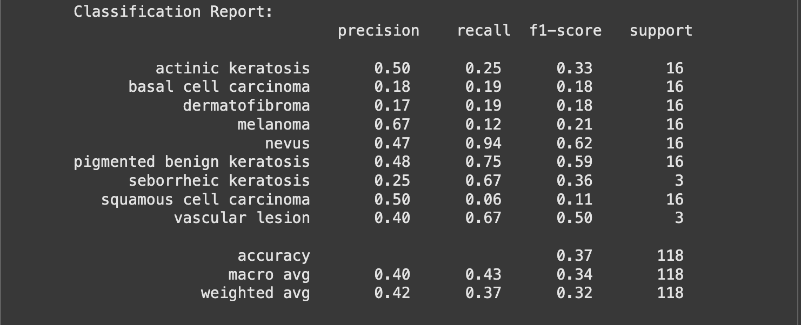

 Melanoma Skin Cancer Detection

## Abstract

In the realm of cancer, there exist over 200 distinct forms, with melanoma standing out as the most lethal type of skin cancer among them. The diagnostic protocol for melanoma typically initiates with clinical screening, followed by dermoscopic analysis and histopathological examination. Early detection of melanoma skin cancer is pivotal, as it significantly enhances the chances of successful treatment. The initial step in diagnosing melanoma skin cancer involves visually inspecting the affected area of the skin. Dermatologists capture dermatoscopic images of the skin lesions using high-speed cameras, which yield diagnostic accuracies ranging from 65% to 80% for melanoma without supplementary technical assistance. Through further visual assessment by oncologists and dermatoscopic image analysis, the overall predictive accuracy of melanoma diagnosis can be elevated to 75% to 84%. The objective of the project is to construct an automated classification system leveraging image processing techniques to classify skin cancer based on images of skin lesions.

## Problem statement

To build a CNN based model which can accurately detect melanoma. Melanoma is a type of cancer that can be deadly if not detected early. It accounts for 75% of skin cancer deaths. A solution which can evaluate images and alert the dermatologists about the presence of melanoma has the potential to reduce a lot of manual effort needed in diagnosis.

## General Information

The dataset comprises 2357 images depicting malignant and benign oncological conditions, sourced from the International Skin Imaging Collaboration (ISIC). These images were categorized based on the classification provided by ISIC, with each subset containing an equal number of images.

## Pictorial representation of skin types

The aim of this task is to assign a specific class label to a particular type of skin cancer.

## Model Architecture

	1.	Normalization (Rescaling(1./255)) keeps inputs in a manageable range.
	2.	Three Convolution + Pooling blocks progressively extract spatial features.
	3.	Flatten transitions from 2D feature maps to a 1D vector.
	4.	Dense + Dropout layers provide high-level reasoning and regularization.
	5.	Softmax Output for multi-class predictions.
	6.	Adam + Sparse Categorical Crossentropy are standard settings for multi-class image classification.

## Model Evaluation

## Classification Report

## Acknowledgements

- UpGrad tutorials on Convolution Neural Networks (CNNs) on the learning platform

- [Melanoma Skin Cancer](https://www.cancer.org/cancer/melanoma-skin-cancer/about/what-is-melanoma.html)

- [Introduction to CNN](https://www.analyticsvidhya.com/blog/2021/05/convolutional-neural-networks-cnn/)

- [Image classification using CNN](https://www.analyticsvidhya.com/blog/2020/02/learn-image-classification-cnn-convolutional-neural-networks-3-datasets/)

- [Efficient way to build CNN architecture](https://towardsdatascience.com/a-guide-to-an-efficient-way-to-build-neural-network-architectures-part-ii-hyper-parameter-42efca01e5d7)

## Collaborators

Created by [@shashankgd](https://github.com/shashankgd)
